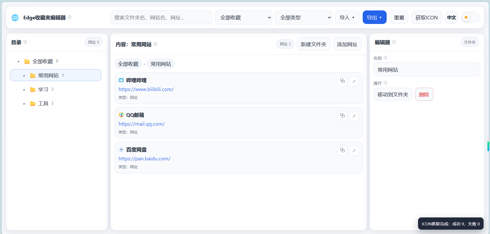

# bookmark_editor

一个纯静态的 Edge 收藏夹编辑器。

可直接在浏览器里打开，用来导入、整理、编辑并重新导出 Edge 的收藏夹 HTML。

## 功能

- 导入/导出收藏夹
- 树状目录、内容列表、编辑区联动
- 自动保存修改
- 支持书签图标查看、网络获取、本地上传
- 支持搜索、筛选、拖拽排序、移动到文件夹
- 支持中英文切换
- 支持明暗主题切换

## 部署方式

- 下载源码到本地，vscode开启http服务
  
- 可以直接放到 Cloudflare Pages、GitHub Pages 等静态托管服务。

## 导入/导出收藏夹

1. 打开收藏夹管理
   
2. 导入/导出收藏夹
   
3. 选择HTML文件
   
4. 导入成功
   

## 常用操作

1. 导入收藏夹 HTML
2. 在左侧目录或中间内容区选中项目
3. 在右侧编辑区修改名称、网址或图标
4. 需要时移动到其他文件夹
5. 最后导出 HTML，再导回 Edge

