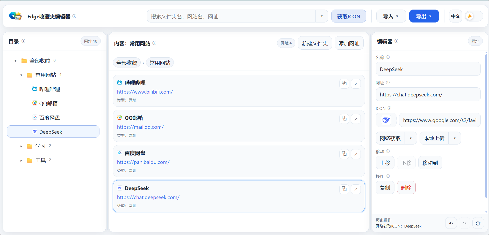
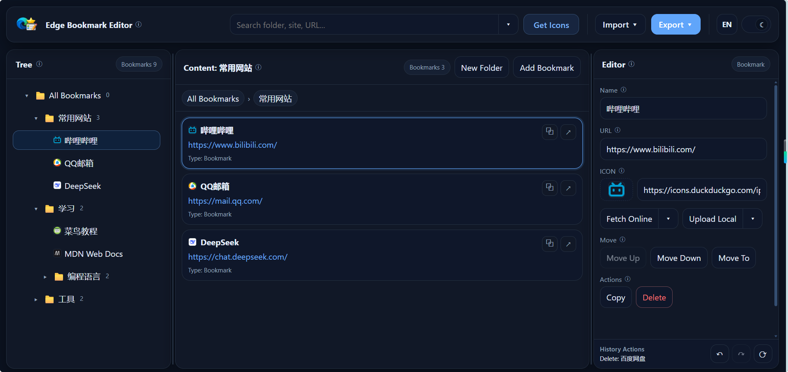
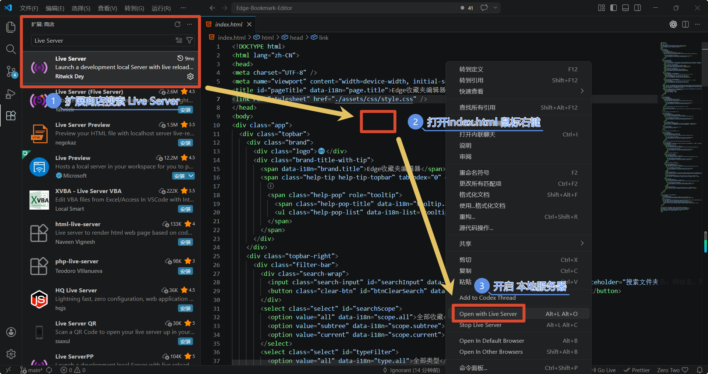
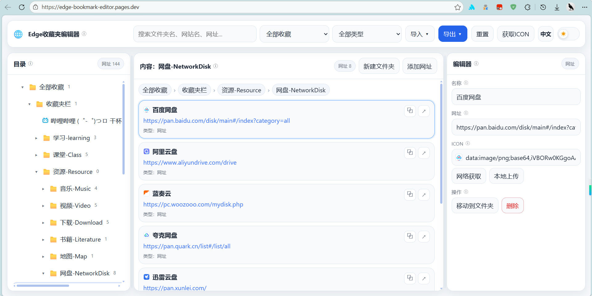
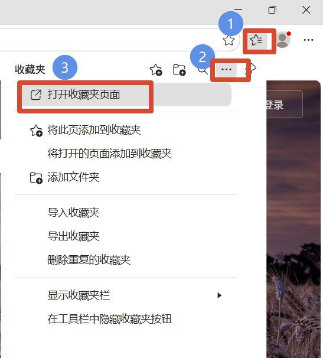
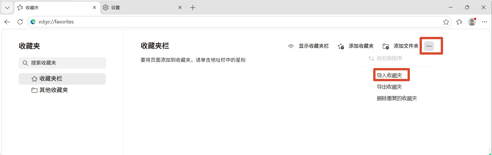
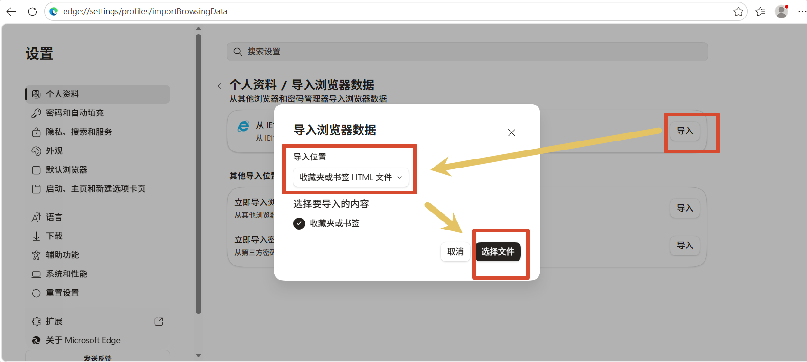
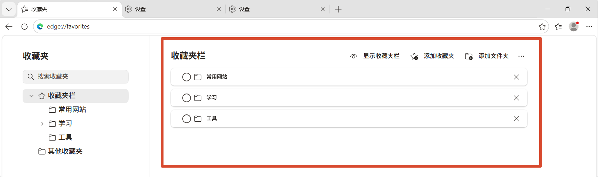

# Edge-Bookmark-Editor

一个纯静态的 Edge 收藏夹编辑器。  
直接在浏览器中打开即可使用：导入 Edge 收藏夹、批量整理、编辑后再导出。

支持中英文、深浅色主题、拖拽排序、图标获取与本地上传、历史操作显示等功能。

## 功能亮点

- 三栏联动：目录区 / 内容区 / 编辑区
- 导入导出：支持 HTML、JSON
- 编辑自动保存：名称、网址、图标实时保存
- 图标处理：
  - 网络获取（模式可选：自动、DuckDuckGo、Favicon.icon、Google S2）
  - 本地上传（支持常见尺寸：16/24/32/48/64）
- 排序与移动：拖拽排序、上移/下移、移动到文件夹
- 操作管理：复制、解散、删除、撤销、重做、重置
- 历史操作区：显示最近一条关键操作（如重命名、改网址、移动、导入等）
- 顶部搜索 + 下拉筛选：按范围与类型快速过滤
- 多语言与主题切换：中文/英文，浅色/深色

## 快速开始

### 方式一：本地直接运行

1. 下载源码
2. 使用任意静态服务器启动（例如 VS Code Live Server）
3. 浏览器打开页面

### 方式二：静态托管部署

可部署到 Cloudflare Pages、GitHub Pages 等静态托管平台。  
示例地址：[edge-bookmark-editor.pages.dev](https://edge-bookmark-editor.pages.dev/)

## Edge 收藏夹导入/导出

1. 在 Edge 打开收藏夹管理页
   
2. 选择导出收藏夹（HTML）
   
3. 在本工具中导入 HTML 并编辑
   
4. 编辑完成后导出 HTML，再导回 Edge
   

## 常用流程

1. 导入收藏夹 HTML（或 JSON）
2. 在目录区/内容区选中要编辑的文件夹或网址
3. 在编辑区修改名称、网址、图标
4. 使用移动、排序、复制、解散等能力整理结构
5. 查看底部“历史操作”确认最近变更
6. 导出 HTML 并导回 Edge

## 说明

- 本项目为纯前端静态工具，不依赖后端服务。
- 推荐使用现代浏览器（最新版 Edge / Chrome / Firefox）。
